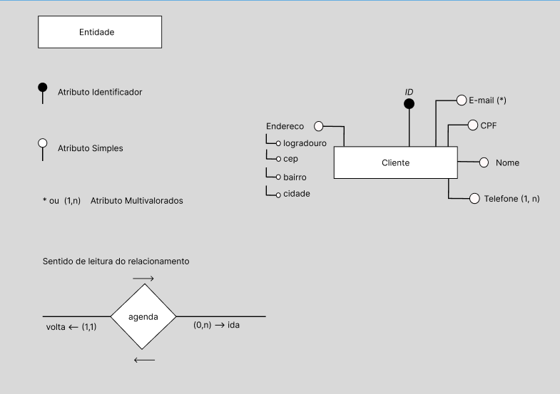
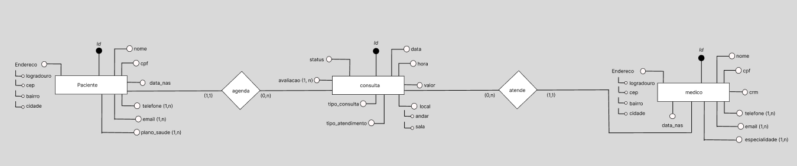

# Aula 01 – Continuação: SGBD e Modelagem Conceitual (MER)

📅 Data da aula: 05/02/2026

Nesta continuação da Aula 01, foram aprofundados os conceitos de Banco de Dados,
com foco no papel do SGBD, nos métodos de acesso aos dados e na introdução à
modelagem conceitual por meio do Modelo Entidade-Relacionamento (MER),
incluindo uma atividade prática de modelagem.

## 🖥️ SGBD – Sistema de Gerenciamento de Banco de Dados
O **SGBD (Sistema de Gerenciamento de Banco de Dados)** é o software responsável
por gerenciar o banco de dados, atuando como o motor que processa, organiza,
consulta e protege os dados armazenados.

- **Banco de Dados (BD)**: local onde é armazenado um conjunto estruturado de dados  
- **SGBD**: software que permite criar, gerenciar, consultar e controlar o acesso aos dados  

O SGBD aplica regras que garantem **segurança, integridade, consistência e controle**
das informações.

## 🛠️ Linguagens e Métodos de Acesso ao Banco de Dados

### DDL – Linguagem de Definição de Dados
Responsável pela **estrutura do banco de dados**.

- `CREATE` → cria estruturas  
- `ALTER` → altera estruturas  
- `DROP` → remove estruturas  

### DML – Linguagem de Manipulação de Dados
Responsável pela **manipulação dos dados armazenados**.

- `INSERT` → insere dados  
- `UPDATE` → atualiza dados  
- `DELETE` → remove dados  
- `SELECT` → consulta dados  

### DCL – Linguagem de Controle de Dados
Responsável pelo **controle de permissões e acessos** ao banco de dados.

## ✅ Vantagens do Uso de um SGBD
Principais benefícios apresentados em aula:

- Rapidez na manipulação dos dados  
- Redução de esforço operacional  
- Redução de duplicidade e inconsistência  
- Maior segurança e controle  
- Precisão das informações  
- Alta disponibilidade  
- Controle centralizado e integrado  

### Banco de Dados no contexto empresarial
Um único banco de dados pode atender diferentes setores da empresa, como:
- Recursos Humanos  
- Vendas  
- Estoque  

Garantindo **integração entre sistemas** e **consistência das informações**.

## 📐 MER – Modelo Entidade-Relacionamento
O **MER** é um **modelo conceitual**, utilizado como rascunho inicial da estrutura
do banco de dados, servindo como base para as próximas etapas da modelagem.

### Entidades
Representam elementos do mundo real, físicos ou abstratos.

**Exemplos:** Aluno, Produto, Cliente, Médico.

### Atributos
São as propriedades que caracterizam as entidades.

Tipos de atributos:
- **Identificador**: normalmente o ID (por padronização)
- **Simples**: características básicas (nome, CPF, telefone)  
- **Composto**: formado por outros atributos (ex: endereço)  
- **Multivalorado**: pode conter mais de um valor (telefone, e-mail, dependentes)  

## 🔗 Relacionamentos
No MER, **relacionamentos** representam como as entidades se conectam e interagem
dentro do sistema. Eles descrevem associações entre entidades com base nas **regras de negócio**, garantindo que os dados reflitam o cenário real da empresa ou sistema.

Exemplo: Um paciente **realiza** consultas ou um paciente **agenda** consulta.

## 🔢 Cardinalidade
A **cardinalidade** define **quantas ocorrências de uma entidade se relacionam
com outra**.

### Tipos apresentados:
- 0 para 1  (0,1)
- 0 para muitos (0,n)   
- 1 para 1  (1,1)
- 1 para muitos (1,n) 
- muitos para muitos (n,n)  

Dica: Para definir corretamente, sempre pergunte:

1. Quantos registros da entidade A podem se relacionar com a entidade B?  
2. Esse relacionamento é obrigatório ou opcional?

✔️ Sempre pensar no **cenário real do sistema**

## 🧪 Atividade Prática – Modelagem Conceitual
Após a explicação dos conceitos de MER, foi proposta uma atividade prática
para desenvolver a modelagem conceitual a partir de uma descrição textual,
sem o uso de softwares específicos de modelagem.

Para a construção do diagrama utilizei o Figma, já que por orientação do professor, não era para ser utilizado softwares próprios de modelagem de entidade

## 🧩 Exemplo de MER apresentado em aula
Diagrama utilizado para demonstrar:
- Entidades
- Tipos de atributos
- Atributo identificador
- Atributos multivalorados
- Sentido de leitura do relacionamento

## 🏥 Exercício – Clínica Médica
Com base na descrição proposta em aula, foi desenvolvido o modelo conceitual
de um banco de dados para uma clínica médica.

O diagrama representa as entidades principais, seus atributos e os
relacionamentos entre pacientes, médicos e consultas.

