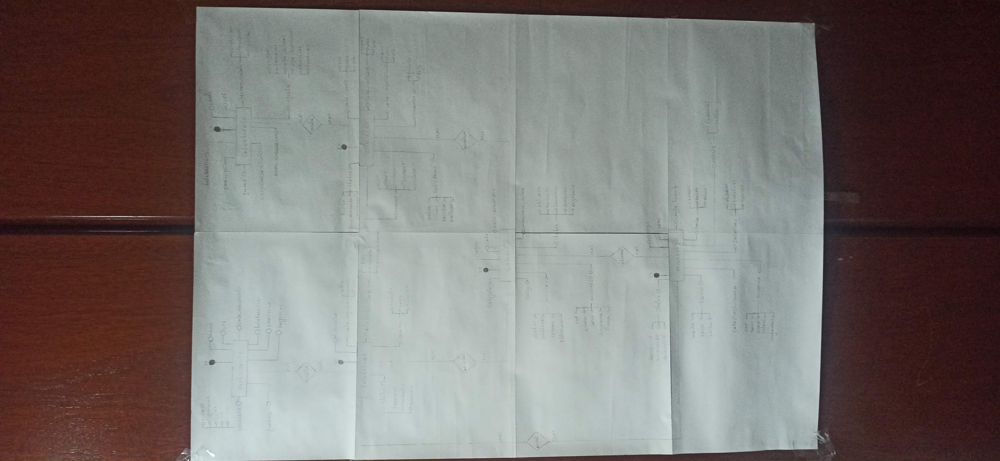
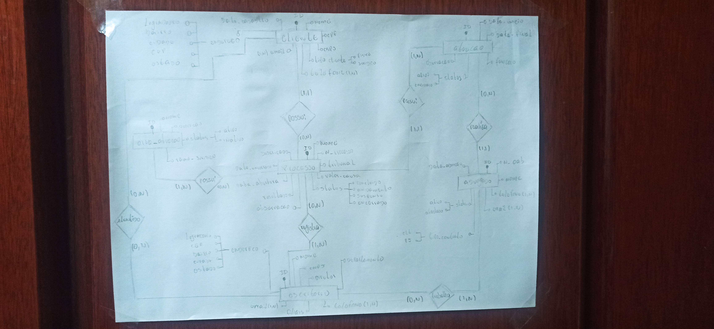

# Aula 02 – Modelagem Conceitual (MER) - exercícios

📅 Data da aula: 12/02/2026

## 🎯 Objetivo da Aula

A Aula 02 teve como foco a construção de **Modelos Entidade-Relacionamento (MER)** a partir de regras de negócio propostas em exercícios práticos.

O objetivo era desenvolver a capacidade de:

- Interpretar requisitos  
- Identificar entidades  
- Definir atributos  
- Estruturar relacionamentos  
- Aplicar cardinalidade mínima e máxima  
- Traduzir regras de negócio em modelo conceitual estruturado  

Mais do que aprender Banco de Dados, essa aula se tornou um exercício de **entrega, mentalidade e evolução**.

Durante a atividade, foram desenvolvidos dois exercícios em folha A4 — cada um com uma abordagem diferente, mas com o mesmo compromisso: **fazer bem feito**.

# 🏆 Exercício 01 – Sistema de Eventos Corporativos  
*(Profundidade como escolha de evolução)*

  

## 📌 Contexto

Modelagem de um sistema para uma empresa organizadora de eventos corporativos, envolvendo:

- Eventos  
- Participantes  
- Palestrantes  
- Minicursos  
- Inscrições  
- Relacionamentos múltiplos com diferentes cardinalidades  

O exercício poderia ser resolvido em uma única folha A4.

## 📄 Desenvolvimento

Durante a execução, optei por revisar a análise com mais profundidade:

- Reinterpretei os requisitos  
- Refinei entidades  
- Ajustei cardinalidades  
- Organizei melhor os relacionamentos  
- Detalhei atributos de forma mais clara  

O resultado final foi desenvolvido em **8 folhas A4**.

Importante destacar:  
Não foi excesso.  
Não foi complexidade desnecessária.  

Foi uma escolha consciente de **aprofundar para entender melhor**.

A intenção foi explorar ao máximo o cenário proposto, garantindo clareza estrutural e coerência nas regras de negócio.

## 🧠 Principais Conceitos Aplicados

- Entidades fortes  
- Relacionamentos N:N  
- Entidades associativas  
- Cardinalidade mínima e máxima  
- Organização modular do modelo  
- Estruturação visual para facilitar leitura  

## 💡 Reflexão

Antes de expandir, é preciso dominar o básico — o famoso “arroz com feijão”.  
Mas quando a base está sólida, você pode evoluir com consistência.

Esse exercício representa exatamente isso:  
**não entregar apenas o necessário, mas entregar o meu melhor possível dentro do que eu sei fazer.**

# 📘 Exercício 02 – Sistema de Escritório de Advocacia  
*(Objetividade com precisão)*

  

## 📌 Contexto

Modelagem de um sistema para controle de:

- Advogados  
- Clientes  
- Processos  
- Áreas de atuação  
- Atuação de advogado em processo  

## 📄 Desenvolvimento

Este exercício foi desenvolvido em **1 folha A4**, atendendo de forma direta e objetiva os requisitos propostos.

A abordagem aqui foi diferente do primeiro:

- Foco na clareza  
- Estrutura enxuta  
- Cardinalidades bem definidas  
- Entidade associativa corretamente aplicada  

Mesmo sendo mais compacto, o modelo contempla:

- Relacionamento N:N entre Advogado e Processo  
- Entidade associativa com atributos (data de início e função)  
- Relação 1:N entre Cliente e Processo  
- Associação entre Processo e Área do Direito  

## 🧠 Conceitos Aplicados

- Entidade associativa com atributos  
- Cardinalidade mínima e máxima  
- Interpretação correta das regras de negócio  
- Organização lógica do MER  

# ⚖ Comparativo entre os Exercícios

| Exercício     | Abordagem      | Tamanho        | Foco                    |
|--------------|---------------|---------------|--------------------------|
| Exercício 01 | Profundidade  | 8 folhas A4   | Evolução e refinamento   |
| Exercício 02 | Objetividade  | 1 folha A4    | Precisão e clareza       |

Ambos atendem aos requisitos da aula.

A diferença está na intenção:

- 📈 O primeiro representa o esforço consciente de evoluir.  
- 📘 O segundo demonstra que é possível ser direto e técnico quando necessário.  

Evolução não é fazer mais por fazer.  
É melhorar a qualidade daquilo que você já sabe fazer.

# 📚 Conteúdos Trabalhados

- Modelo Entidade-Relacionamento (MER)  
- Entidades e atributos  
- Relacionamentos  
- Cardinalidade mínima e máxima  
- Entidade associativa  
- Interpretação de regras de negócio  
- Organização visual do modelo conceitual  

# 👨‍🏫 Orientação Acadêmica

A atividade foi desenvolvida na disciplina de Banco de Dados, com acompanhamento do professor Marcel.

# 🚀 Reflexão Final

Não importa se é “apenas” um exercício.  
Não importa se cabe em uma folha A4.

Quando você decide entregar o seu melhor, você cresce:

- Como estudante  
- Como futuro profissional  
- Como pessoa  

Este repositório registra não apenas modelos conceituais, mas um processo de evolução.